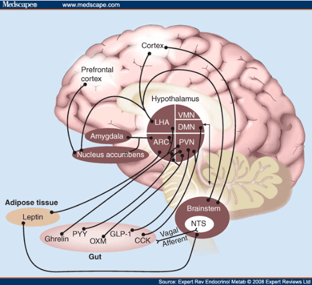
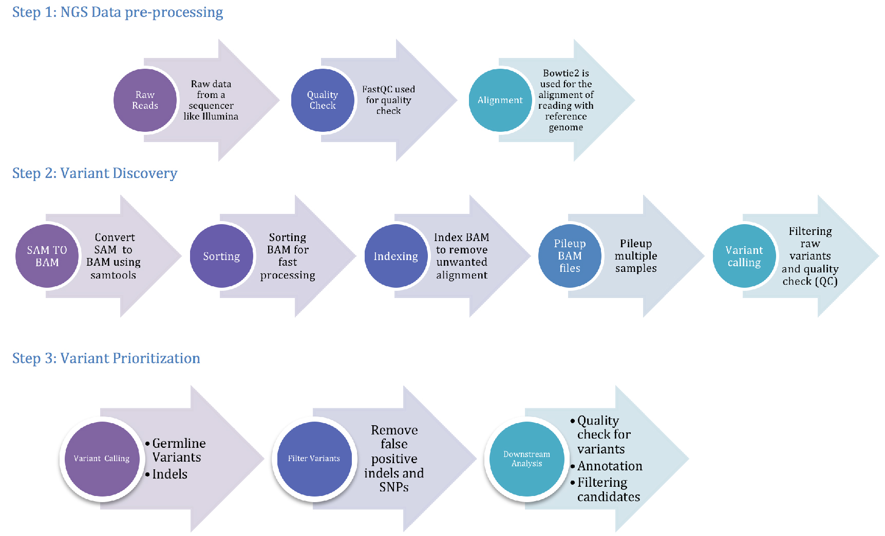
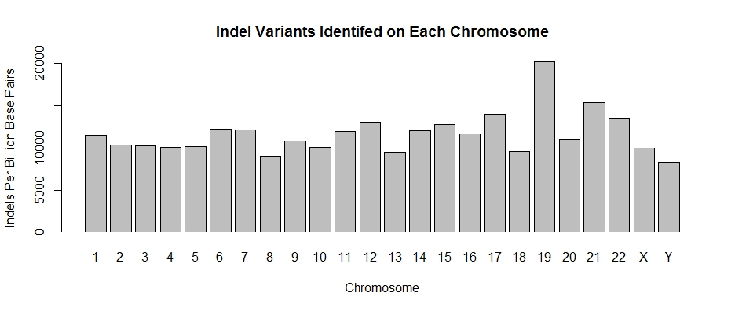

```{r setup, include=FALSE}
library(tidyverse)
library(ggplot2)
library(ggrepel)
library(splitstackshape)
library(magrittr)
library(knitr)
library(matrixStats)
```

# Introduction

The prevalence of obesity, defined as a Body Mass Index (BMI) ≥ 30, is documented by the National Center for Health Statistics at 42.4% as of 2018. This represents nearly a 22% increase since 2000, with the prevalence of severe obesity (BMI ≥ 40) nearly doubling from 4.7% to 9.2% over the same time interval. Obesity contributes to a variety of illnesses, such as heart disease, stroke, and type 2 diabetes. In 2008, obesity contributed to \$147 billion in the American healthcare system, and obese Americans were found to have medical costs over $1400 greater on average than healthy individuals.<sup>1</sup> 

Obesity is a polygenic disease with a number of causes. In general, obesity is determined by a combination of food intake, metabolic efficiency, and daily activity levels. This project focuses on the genetic factors contributing to increased food intake that lead some individuals to crave greater caloric intake. Food intake is determined primarily by appetite, hunger, and satiety signals that are produced by the hypothalamus in the central nervous system. These signals include neuropeptides such as neuropeptide Y (NPY) and α-melanocyte-stimulating hormone, as well as compounds that respond to peripheral signaling hormones that regulate food intake such as insulin, leptin, peptide YY, and ghrelin (Fig. 1).<sup>2,3</sup>  Furthermore, genome-wide association studies have shown that this signalling pathway has a genetic component.<sup>4</sup>  Mutations in hypothalamic-specific genes further suggest that the hypothalamus plays a central genetic component in obesity in humans.<sup>2</sup> 



For this project, whole-exome sequencing (WES) analysis of hypothalamic neurons from obese patients was compared to a reference genome (GRCh38) via single-nucleotide variants (SNVs) and insertions and deletions (indels). The choice to use a reference genome for comparison was made due to the fact that identified genetic loci account for <3% of variation in BMI.<sup>4</sup>  In addition, patients with severe obesity are more likely to exhibit rare genetic variants. Thus, WES is a particularly effective sequencing method for studying severe obesity. WES is known to be most efficient in patients with extreme forms of common diseases for two main reasons. First, rare and low-frequency variants must have a high penetrance to allow statistical detection. In addition, sequencing variants in the protein coding sequence may be more likely to  have a stronger impact on phenotypes than variants in intergenic regions. Many known genetic causes of obesity are associated with a severe phenotype and have a larger impact on BMI. Because this project is studying subjects with BMI ≥ 50, or superobese subjects, WES is an optimal sequencing method.<sup>6</sup> 

# Methods and Materials

## Library Preparation and Dataset

Blood samples were obtained from 5 superobese patients (BMI ≥ 50) from Cedars Sinai. Peripheral blood mononuclear cells were obtained from these blood draws and reprogrammed to create an induced pluripotent stem cell (iPSC) line as described by Barrett et. al.<sup>7</sup> These iPSCs were then used to create iPSC derived hypothalamic neurons (iHTNs), which were then used for whole-exome sequencing using the Agilent SureSelect Human All Exon V4 Kit.2 Library preparation was done using Agilent SureSelect Human All Exon V4 kit (Agilent Technologies, CA, USA). 180-280 bp fragments were generated from 1 μg of genomic DNA with a M200 shearing system (Covaris, Massachusetts, USA), followed by end-repair, A-tailing, adapter ligation, PCR enrichment, and hybridization with biotin probes for capture with streptomycin. Indexing PCR was performed following library capture. These PCR products were then purified using the AMPureXP system and quantified using Agilent high sensitivity DNA assay with the Agilent Bioanalyzer 2100 system. Reads were done with HiSeq X Ten (Illumina, San Diego, CA) with paired-end 2x150bp sequencing settings for an average sequencing depth of approximately 43.5M reads.<sup>2</sup> The dataset from Rajamani et al. was then processed using the WES pipeline described by Meena et al. (Fig. 2)<sup>8</sup>

```{r patient table, echo=FALSE}
tab <- read.csv("patient_info.csv")
colnames(tab)[1] <- "Run"
kable(tab, caption = "Table 1. WES Sample Info, some info was not provided for control samples")
```

## WES Pipeline

 

The pipeline was broken up into multiple scripts. As a result, repetitive, non-essential sections such as "module load" or "cd" were excluded.

```{bash, eval=FALSE}
########################## pre-processing ############################
# wget SRA manually

# quality control
fastqc /scratch/pl9ed/project/wes_data/*.fastq

# align reference
bowtie2-build --threads 8 -f *.fa ref

# fastq > bam
fileList=($(cat /scratch/pl9ed/project/list.txt))
cList=($(cat /scratch/pl9ed/project/clist.txt))

fileName=${fileList[$n]}
cName=${cList[$n]}

n=$SLURM_ARRAY_TASK_ID

echo "aligning " $fileName
bowtie2 -p 8 -x /scratch/pl9ed/project/refgenome/ref -1 ./"$fileName"_1.fastq -2 ./"$fileName"_2.fastq -S $fileName.sam
```

The raw dataset was first downloaded from SRA into a scratch subfolder, which was then given read/write/execute permissions. The raw files were converted into both .fastq and .sam files using the SRAToolKit (2.9.1). Alignment was done using Bowtie2 (2.2.9) with the soft-masked, primary assembly reference genome (GRCh38) from ENSEMBL. FastQC (0.11.5) was used to conduct quality control checks on the dataset. Preprocessing resulted in a sam file for each sample.

```{bash, eval=FALSE}
########################## variant discovery ############################
# bam > sort/index > mpileup
echo "converting $fileName to bam"
samtools view -bS "$fileName".sam > $fileName.bam
samtools sort -@ 16 "$fileName".bam > "$fileName".sorted.bam
samtools index -@ 16 "$fileName".sorted.bam
samtools mpileup -E -@ 16 -uf /scratch/pl9ed/project/refgenome/Homo_sapiens.GRCh38.dna_sm.primary_assembly.fa \
	"$fileName".sorted.bam > "$fileName".mpileup 

########################## variant prioritization ############################
# VarScan
echo "-------------mpileup2snp-------------"
java -jar VarScan.v2.4.4.jar mpileup2snp $fileName.mpileup --variants > $fileName.v.snp
echo "-------------mpileup2indel-------------"
java -jar VarScan.v2.4.4.jar mpileup2indel $fileName.mpileup --variants > $fileName.v.indel
echo "-------------filter snp-------------"
java -jar VarScan.v2.4.4.jar filter $fileName.v.snp --indel-file $fileName.v.indel --output-file $fileName.v.snp.filter
echo "-------------filter indel-------------"
java -jar VarScan.v2.4.4.jar filter $fileName.v.indel --output-file $fileName.v.indel.filter
echo "-------------readcounts-------------"
java -jar VarScan.v2.4.4.jar readcounts $fileName.mpileup --output-file $fileName.readcounts

# bcftools
echo "Working on $fileName"
echo "n: $n"

bcftools mpileup -f /scratch/pl9ed/project/refgenome/Homo_sapiens.GRCh38.dna_sm.primary_assembly.fa \
$fileName.sorted.bam --threads 16 -o $fileName.bcf
echo "-------calls-------"
bcftools call $fileName.bcf --threads 16 -mv -Ob -o $fileName.calls.bcf
echo "-------filter-------"
bcftools filter -i'%QUAL>20' $fileName.calls.bcf -Ov -o $fileName.calls.filtered.vcf
```

Following pre-processing, SAMtools (1.10) was used to convert .sam files to sorted BAM files for further processing. In contrast to the original pipeline, variant calling and filtering was done using bcftools (1.9) rather than VarScan. VarScan requires SNVs and indels to be processed separately, whereas Binary Variant Call Format (BCF) / Variant Call Format (VCF) succinctly holds information for both variants. Thus, bcftools was used to create an mpileup using the sorted BAM files, followed by variant calling, and filtering. Filtering was done based on quality scores with a cutoff QUAL of 20. 

```{bash, eval=FALSE}
########################## annotate ############################
echo "fileName: $fileName"
echo "cName: $cName"

# vcf to avninput - easier to process later
./convert2annovar.pl -format vcf4 ../wes_data/$fileName.calls.filtered.vcf > $fileName.avinput
./convert2annovar.pl -format vcf4 ../control/$cName.calls.filtered.vcf > $cName.avinput

# annotate
./table_annovar.pl $fileName.avinput humandb/ \
	-buildver hg19 \
	-out $fileName \
	-remove -protocol refGene,cytoBand,exac03,avsnp147,dbnsfp30a \
	-operation gx,r,f,f,f \
	-nastring . \
	-csvout -polish -xref example/gene_xref.txt
./table_annovar.pl $cName.avinput humandb/ \
	-buildver hg19 \
	-out $cName \
	-remove -protocol refGene,cytoBand,exac03,avsnp147,dbnsfp30a \
	-operation gx,r,f,f,f \
	-nastring . \
	-csvout -polish -xref example/gene_xref.txt

done
```

For readability, the BCF files were converted to VCF, then to avinput before annotation using ANNOVAR (2019Oct24 version), resulting in an annotated csv file for each sample. These files were then used to identify the number of SNVs and indels associated with each gene for each sample, adjusted for read depth, leading to variants per billion BP of exome (V/GBP). Variants associated with multiple genes were counted multiple times. Principal component analysis (PCA) was performed on the dataset, and genes with the highest V/GBP were identified for both obese and control groups. Variants found exclusively in the obese group were then mapped to their chromosomes based on position.

The positions of variants were then mapped to the chromosome based on the starting position, with a bin width of 100000BP. ([See Appendix](#positionplot))

## RScript for Post-Processing

### Initial Data Load

```{r data init, eval=FALSE}
# NOT USED FOR KNITTING
# load data
# lists of filenames
clist = vector(length=5)
olist = vector(length=5)

for (i in 1:5) {
  fname <- paste0("ob",i)
  assign(fname,read.csv(paste0(fname,".csv"), colClasses = c(rep(NA,12), rep("NULL",43))))
  olist[i] <- fname
  
  cname <- paste0("ctr",i)
  assign(cname,read.csv(paste0(cname,".csv"), colClasses = c(rep(NA,12), rep("NULL",43))))
  clist[i] <- cname
}

# total obese set
dat <- ob1
for (i in 2:length(olist)) {
  dat <- rbind(dat,get(olist[i]))
}

# total control set
dat_c <- ctr1
for (i in 2:length(clist)) {
  dat_c <- rbind(dat_c,get(clist[i]))
}
# Data saved. Don't need to run this chunk again
```

Data was read in from annotated variant calls, used to create two lists that contain the names of the variables for each sample, and each group was merged into master obese and control sets. 

```{r load data, include=FALSE}
# USED FOR KNITTING
load("C:\\Users\\pl9ed\\OneDrive\\Desktop\\vcf\\4550\\anno.RData")
```

### Finding Unique Genes with Variants

``` {r uniq genes, eval=FALSE}
# list of unique genes found
glist <- as.data.frame(unique(dat$Gene.refGene))
colnames(glist) <- "gene"
glist <- cSplit(glist,"gene",sep=";")
glist_u <- unique(as.vector(as.matrix(glist)))

# table of genes for each variant
glist <- as.data.frame(dat$Gene.refGene)
colnames(glist) <- "gene"
glist <- cSplit(glist,"gene",sep=";")

# to: Rivanna
```

Genes associated with each variant were identified. Intergenic variants are counted multiple times, once for each gene, using cSplit. glist is a table of genes associated with each variant. glist_u is a list of unique genes found within that list. 

### Create Dataset of Variants per Billion BP of Exome

```{bash list, eval=FALSE}
# SNV/Indel counts:
# ug.csv and glist.csv from R script
# create CSV of [Gene, Count] for each sample
echo "Working on $oName and $cName"

for i in $(cat ../av_scripts/ug.csv)
do

gcount=$(grep $i $oName*.csv | wc -l)
echo "$i, $gcount" >> ../gene_counts/$oName.count.csv

ccount=$(grep $i $cName*.csv | wc -l)
echo "$i, $ccount" >> ../gene_counts/$cName.count.csv
```
```{r create count set}
# control is actually counts for all 10
# name control is leftover - didn't want to change 
temp <- read.csv("SRR5279736.1.csv",header=FALSE)
colnames(temp) <- c("Gene","SRR5279736.1")
control <- temp
temp <- read.csv("SRR5279740.1.csv",header=FALSE)
control <- mutate(control,SRR5279740.1 = temp$V2)
control <- mutate(control,SRR5279752.1 = read.csv("SRR5279752.1.csv",header=FALSE)[,2])
control <- mutate(control,SRR5279760.1 = read.csv("SRR5279760.1.csv",header=FALSE)[,2])
control <- mutate(control,SRR5279784.1 = read.csv("SRR5279784.1.csv",header=FALSE)[,2])
control <- mutate(control,SRR6318351.1 = read.csv("SRR6318351.1.csv",header=FALSE)[,2])
control <- mutate(control,SRR6318352.1 = read.csv("SRR6318352.1.csv",header=FALSE)[,2])
control <- mutate(control,SRR6318353.1 = read.csv("SRR6318353.1.csv",header=FALSE)[,2])
control <- mutate(control,SRR6318354.1 = read.csv("SRR6318354.1.csv",header=FALSE)[,2])
control <- mutate(control,SRR6318355.1 = read.csv("SRR6318355.1.csv",header=FALSE)[,2])
# NA's were product of Csplit to get multigene SNVs
control <- na.omit(control)

# first col to rownames
gene_names <- control[,1]
control <- control[,-1]
rownames(control) <- gene_names
# control_backup <- control


# adjust for read depth
# we get number of SNVs per gene per billion BP
control <- mutate(control,SRR5279736.1 = SRR5279736.1  *1E9 / 472.92E6)
control <- mutate(control,SRR5279740.1 = SRR5279740.1  *1E9 / 827.51E6)
control <- mutate(control,SRR5279752.1 = SRR5279752.1  *1E9 / 411.78E6)
control <- mutate(control,SRR5279760.1 = SRR5279760.1  *1E9 / 710.63E6)
control <- mutate(control,SRR5279784.1 = SRR5279784.1  *1E9 / 601.36E6)
control <- mutate(control,SRR6318351.1 = SRR6318351.1  *1E9 / 13.13E9)
control <- mutate(control,SRR6318352.1 = SRR6318352.1  *1E9 / 12.50E9)
control <- mutate(control,SRR6318353.1 = SRR6318353.1  *1E9 / 14.73E9)
control <- mutate(control,SRR6318354.1 = SRR6318354.1  *1E9 / 12.27E9)
control <- mutate(control,SRR6318355.1 = SRR6318355.1  *1E9 / 12.58E9)

# rownames(control) <- nl_names
rownames(control) <- gene_names

```

The number of variants associated with each gene were found for each patient and used to create an overall dataset. This dataset was then adjusted for sequencing depth. Rows correspond to genes; columns correspond to patients. Values are the number of variants for each gene for each patient.

```{r glength, eval=FALSE, include=FALSE}
# ad just for gene length
gl <- read.csv("lengthindex.txt")
colnames(gl)[3:4]<- c("end","start")
# +1 because inclusive
gl <- mutate(gl,length = end-start+1)
# order for speed
gl <- gl[order(gl$Gene.name),]
```

``` {r get length, eval=FALSE, include=FALSE, warning=FALSE}
test <- match(rownames(control), gl$Gene.name)
# rownames(test) <- gene_names
lengths <- gl[test,7]
write.csv(lengths,"gene_lengths.csv")

# test <- control / lengths
test <- mutate(control, length = lengths, name = gene_names)
rownames(test) <- gene_names
list <- filter(test,is.na(test$length))
```

```{r gene length adj, eval=FALSE, include=FALSE}
# test2 <- mutate(control_backup, length = test)
# rownames(test2) <- gene_names
# test2 <- rownames_to_column(test2)
# # 1962 genes not found in BioMart, length set to -1
# no_length <- filter(test2,length!=-1)
# nl_names <- no_length[,1]
# rownames(no_length) <- nl_names
# no_length <- no_length[,-1]
control <- control * 1E9 / test # adjusted for gene length

```

# Results

### PCA

```{r pca, message=FALSE}
Yo = control - rowMeans(control)

po <- prcomp(t(Yo))
o_scores <- po$x
o_load <- po$rotation

group <- vector(length=10)

for (i in 1:5) {
  group[i] <- "Control"
}
for (i in 6:10) {
  group[i] <- "Obese"
}

group <- factor(group)

# plots
plot(o_scores[,1],o_scores[,2],pch=21,bg=as.numeric(group),xlab="PC1",ylab="PC2", main="Score Plot")
legend("bottomleft",levels(group),col=seq(along=levels(group)),pch=15,cex=1.0)
# text(o_scores[1:10,1],o_scores[1:10,2],labels=rownames(o_scores[1:10,]),cex=0.7,adj=1)

abs_load <- abs(o_load)
load1 <- abs_load[order(abs_load[,1],decreasing=TRUE)[1:5],]
load2 <- abs_load[order(abs_load[,2],decreasing=TRUE)[1:5],]
l1 <- rownames(load1)
l2 <- rownames(load2)

pl1 <- o_load[row.names(o_load) %in% l1,1]
pl1 <- pl1[order(abs(pl1),decreasing=TRUE)]
pl2 <- o_load[row.names(o_load) %in% l2,2]
pl2 <- pl2[order(abs(pl2),decreasing=TRUE)]

loading_gg <- as.data.frame(cbind(pl1,pl2))

ggplot(loading_gg,aes(pl1,pl2)) +
  geom_point(color="red") +
  geom_segment(aes(0,0,xend=pl1,yend=pl2),arrow=arrow()) +
  geom_label_repel(aes(label=rownames(loading_gg)),box.padding=unit(0.4,'lines')) +
  xlab("PC1") +
  ylab("PC2") +
  ggtitle("Loading Plot")
```

```{r top5, message=FALSE}
top5 <- rownames(as.data.frame(pl1))
dat2 <- rownames_to_column(control,var="gene")
dat_top5 <- dat2[dat2$gene %in% top5,]
rownames(dat_top5) <- top5

dat_top5 <- t(dat_top5[,-1])

ctr_top5 <- dat_top5[1:5,]
ob_top5 <- dat_top5[6:10,]

# rownames(ctr_top5) <- top5
# rownames(ob_top5) <- top5

t_results <- lapply(1:5,function(i) {
  t.test(ctr_top5[,i],ob_top5[,i],paired=TRUE,conf.level=0.95)
})

p_values <- lapply(1:5,function(i) {
  t_results[[i]][["p.value"]]
})

p_values <- unlist(p_values)
p_val_adj <- p.adjust(p_values,"bonferroni")
p_val_adj <- as.data.frame(p_val_adj)
rownames(p_val_adj) <- top5

# means for table
ctr_means <- colMeans(ctr_top5)
ctr_sdev <- colSds(ctr_top5)
ob_means <- colMeans(ob_top5)
ob_sdev <- colSds(ob_top5)

table2 <- do.call("cbind", list(ctr_means, ctr_sdev, ob_means, ob_sdev, p_val_adj))
colnames(table2) <- c("Control Mean V/GBP", "Control Stdev", "Obese Mean V/GBP", "Obese Stdev", "Bonferroni p-value")

kable(table2,caption="Table 2. T-Test for PC1 Loadings")

```

From the annotated variant calls, 24,831 unique genes with SNVs and/or indels were found. Most of the variance within the dataset was due to the difference between the obese and control groups. In addition, based on the score plot, the variance within the control group was much greater than within the obese group. Since obesity is known to have a genetic component, this result is not surprising. Variants for a set of super obese patients should be more similar than variants for a control group of random people within general population. Loadings from PC1 from the PCA also showed that NBPF19, SLC15A5, IGF1R, ASIC2, and GALNT9 were responsible for most of the variance between the two groups. A paired t-test, adjusted using Bonferroni correction, showed that of these, variants in NBPF19, ASIC2, and GALNT9 were statistically significant (p < 0.05) between the experimental and control groups (Table 2). These genes were found to have greater V/GBP when compared to the obese group. However, since hypothalamic neurons are difficult to obtain, the control group was collected from car crash donors, thus the control group may not be representative of the general population. For example, mutations in NBPF19 have been associated with neuronal intranuclear inclusion disease, whose symptoms include cognitive impairments such as pyramidal and extrapyramidal symptoms and cerebellar ataxia.<sup>9,10</sup> Thus, variants in genes such as NBPF19 may be overstated in car crash victims.

### Genes with the most variants

```{r variants}
ob <- control[,6:10]

# add col for mean expression
ob <- mutate(ob,Avg=rowMeans(ob))
ob <- mutate(ob,gene_names)

ctr <- control[,1:5]

# add col for mean expression
ctr <- mutate(ctr,Avg=rowMeans(ctr))
ctr <- mutate(ctr,gene_names)

# list of most difference in avg v/gbp
avg_dif <- ob$Avg - ctr$Avg
avg_dif <- sort(avg_dif,decreasing=TRUE)
avg_dif <- as.data.frame(avg_dif)
top5 <- rownames(avg_dif)[1:5]
# t test
dat_top5 <- dat2[dat2$gene %in% top5,]

# order desc rather than order they appear
dat_top5 <- mutate(dat_top5, gene = factor(gene, levels = c("RBFOX1","DSCAM","SORCS2","PKD1L2","PRKN"))) %>% arrange(gene)

top5 <- dat_top5$gene
dat_top5 <- as.data.frame(dat_top5)
rownames(dat_top5) <- top5
dat_top5 <- t(dat_top5)
dat_top5 <- dat_top5[-1,]
class(dat_top5) <- "numeric"

ctr_top5 <- dat_top5[1:5,]
ob_top5 <- dat_top5[6:10,]

t_results <- lapply(1:5, function(i) {
  t.test(ctr_top5[,i],ob_top5[,i],paired=TRUE,conf.level=0.95)
})

p_values <- lapply(1:5,function(i) {
  t_results[[i]][["p.value"]]
})

p_values <- unlist(p_values)
p_val_adj <- p.adjust(p_values,"bonferroni")
p_val_adj <- as.data.frame(p_val_adj)
rownames(p_val_adj) <- top5

# plot
c_sds <- rowSds(t(ctr_top5))
o_sds <- rowSds(t(ob_top5))
c_m <- rowMeans(t(ctr_top5))
o_m <- rowMeans(t(ob_top5))
meanplots <- cbind(c_m,c_sds)
temp <- cbind(o_m,o_sds)
meanplots <- rbind(meanplots, temp)
meanplots <- cbind(as.data.frame(meanplots), group)
meanplots <- rownames_to_column(as.data.frame(meanplots),var = "gene")
meanplots$gene[6:10] <- as.character(top5)
colnames(meanplots)[2:3] <- c("mean", "stdev")

mtable <- do.call("cbind", list(c_m,c_sds,o_m,o_sds,avg_dif[1:5,],p_val_adj))
colnames(mtable) <- c("Control mean V/GBP", "Control Stdev", "Obese Mean V/GBP", "Obese Stdev", "Mean Difference", "Bonferroni p-value")

# mean diff table
kable(mtable,caption="Table 3. T-Test for Genes with the Greatest Difference in V/GBP")

# same order
meanplots <- mutate(meanplots, gene = factor(gene, levels = c("RBFOX1","DSCAM","SORCS2","PKD1L2","PRKN")))

ggplot(meanplots,aes(gene,mean,fill=group)) +
  geom_col(position="dodge") +
  geom_errorbar(aes(gene,ymin=mean-stdev,ymax=mean+stdev),width=0.2,position=position_dodge(0.9)) +
  ylab("Mean V/GBP") +
  ggtitle("Genes with the most variants in super obese patients, relative to control")
```

In addition to PCA, genes with the greatest difference in the number of V/GBP between the super obese and control groups were found (Table 3). Number of variants in RBFOX1, PKD1L2, DSCAM, SORCS2, and PRKN were all found to be significantly greater in super obese patients compared to the control (Table 4). Bonferroni corrected t-tests were done, and all 5 genes were found to be significantly different.

### Indel Breakdown

```{r, eval=FALSE}
# Load in obese patient indel data
setwd("C:/Users/akp8v_000/Documents/")
flist <- list.files(pattern="\\.indel$")
dlist <- vector(length=length(flist))
for (i in 1:length(flist)) {
  fname <- paste0("dat",i)
  assign(fname,read.delim(flist[i]))
  dlist[i] <- fname
}

# load in control patient indel data
setwd("C:/Users/akp8v_000/Documents/project/")
flist_c <- list.files(pattern="\\.indel$")
dlist_c <- vector(length=length(flist_c))

for (i in 1:length(flist_c)) {
  fname <- paste0("dat",i,"c")
  assign(fname,read.delim(flist_c[i]))
  dlist_c[i] <- fname
}

# total indel set
dat <- dat1
for (i in 2:length(dlist)) {
  dat <- rbind(dat,get(dlist[i]))
}

# total control set
dat_c <- dat1c
for (i in 2:length(dlist_c)) {
  dat_c <- rbind(dat_c,get(dlist_c[i]))
}

temp1 <- select(dat,Chrom,Position,Ref,Var)
temp2 <- select(dat_c,Chrom,Position,Ref,Var)
dif <-setdiff(temp1,temp2)

chromosome_indel_counts <- dif %>% group_by(Chrom) %>% count()
```

```{r, eval=FALSE}
data <- read.csv("data.csv")

barplot(data$ipm,main = "Indel Variants Identifed on Each Chromosome",xlab="Chromosome",ylab="Indels Per Billion Base Pairs", names.arg = c("1","2","3","4","5","6","7","8","9","10","11","12","13","14","15","16","17","18","19","20","21","22","X","Y"))
```


From the indel data obtained, only the variants among the first twenty three chromosomes were used. Indels unique to the obese group were identified by all of the occurences of indels in the exome not present in the control group. The total number of indels were identified per chromosome and normalized for the length of each chromosome. After normalizing for the total number of base pairs, the number was adjusted by 1E9 to give indels per GBP per chromosome. The results showed that chromosomes 19,21,17,22, and 12 had the highest number of indels per GBP. Furthermore, all chromosomes showed relatively similar counts of normalized indel counts. The standard deviation amongst the first 23 chromosomes was found to be 2513.6 indels per billion base pairs. 

# Discussion

### Limitations
Since no gene expression data was available, it is difficult to make causal claims for extreme obesity. Instead, this study aims to identify genes that may be linked to obesity by identifying which genes among super obese patients showed the greatest number of variants. Furthermore, it may be possible that certain mutations in NBPF19, ASIC2, IGF1R, SLC15A5, and PBX3 are inversely correlated with obesity as they had the greatest contribution to PC1. However, further research is necessary to confirm this hypothesis, as this difference may be due to sampling bias when obtaining the control samples from car crash victims.

### Future Work
Our study offers an exploratory analysis into genetic variants in extreme forms of obesity, and identifies potential avenues for further research. Interestingly, a number of genes were found to contain greater V/GBP in the control than the obese group. As mentioned above,  certain mutations in NBPF19, ASIC2, IGF1R, SLC15A5, and PBX3 may inversely correlate with obesity, but possible sampling bias may affect these results. Using iHTNs obtained from the general population rather than HTNs from car accident donors in a future study may help eliminate potential sampling biases. 

For the obese group, CTNNA3 was found to have higher V/GBP in super obese patients compared to the control. This result further confirms earlier findings that link CTNNA3 to metabolic syndrome in Africans and to arrhythmogenic right ventricular dysplasia, which is unsurprising given the correlation between obesity and cardiovascular disease.<sup>11,12</sup> Furthermore, several other genes were identified as having greater V/GBP. A follow up study using iHTNs from the general population, paired with gene expression data, would help to validate our exploratory results.

# References

1.	CDC. Adult Obesity Facts. Centers for Disease Control and Prevention https://www.cdc.gov/obesity/data/adult.html (2020).
2.	Rajamani, U. et al. Super-Obese Patient-Derived iPSC Hypothalamic Neurons Exhibit Obesogenic Signatures and Hormone Responses. Cell Stem Cell 22, 698-712.e9 (2018).
3.	Wang, L. et al. Differentiation of hypothalamic-like neurons from human pluripotent stem cells. J. Clin. Invest. 125, 796–808 (2015).
4.	Locke, A. E. et al. Genetic studies of body mass index yield new insights for obesity biology. Nature 518, 197–206 (2015).
5.	Hypothalamic Regulation of Appetite. Medscape http://www.medscape.com/viewarticle/581204.
6.	Jiao, H. et al. Whole-Exome Sequencing Suggests LAMB3 as a Susceptibility Gene for Morbid Obesity. Diabetes 65, 2980–2989 (2016).
7.	Barrett, R. et al. Reliable Generation of Induced Pluripotent Stem Cells From Human Lymphoblastoid Cell Lines. Stem Cells Transl. Med. 3, 1429–1434 (2014).
8.	Meena, N., Mathur, P., Medicherla, K. & Suravajhala, P. A Bioinformatics Pipeline for Whole Exome Sequencing: Overview of the Processing and Steps from Raw Data to Downstream Analysis. BIO-Protoc. 8, (2018).
9.	Ishiura, H. et al. Noncoding CGG repeat expansions in neuronal intranuclear inclusion disease, oculopharyngodistal myopathy and an overlapping disease. Nat. Genet. 51, 1222–1232 (2019).
10.	OMIM Clinical Synopsis - #603472 - NEURONAL INTRANUCLEAR INCLUSION DISEASE; NIID. https://omim.org/clinicalSynopsis/603472.
11.	CTNNA3 catenin alpha 3 [Homo sapiens (human)] - Gene - NCBI. https://www.ncbi.nlm.nih.gov/gene/29119.
12.	Doumatey, A. P., Ekoru, K., Adeyemo, A. & Rotimi, C. N. Genetic Basis of Obesity and Type 2 Diabetes in Africans: Impact on Precision Medicine. Curr. Diab. Rep. 19, 105 (2019).

# Appendix

```{bash, eval=FALSE}
########################## visualize ############################
# bam to bedgraph
bedtools genomecov -bg -ibam SRR6318351.1.sorted.bam > SRR6318351.1.sorted.forbigwig.bedgraph
bedtools genomecov -bg -ibam SRR6318352.1.sorted.bam > SRR6318352.1.sorted.forbigwig.bedgraph
bedtools genomecov -bg -ibam SRR6318353.1.sorted.bam > SRR6318353.1.sorted.forbigwig.bedgraph
bedtools genomecov -bg -ibam SRR6318354.1.sorted.bam > SRR6318354.1.sorted.forbigwig.bedgraph
bedtools genomecov -bg -ibam SRR6318355.1.sorted.bam > SRR6318355.1.sorted.forbigwig.bedgraph

# bedgraph to bigwig package
wget http://hgdownload.soe.ucsc.edu/goldenPath/hg19/bigZips/hg19.chrom.sizes -o hg19.tmp.sizes
#downloading fetchChromSizes script to create chrom.sizes file for UCSC human genome database (for use in bedGraphToBigWig file conversion)
rsync -aP rsync://hgdownload.soe.ucsc.edu/genome/admin/exe/linux.x86_64/bedGraphToBigWig .

```

<a name="positionplot"></a>

### Position Maps of Variants per Chromosome

Scaffolds not included.

```{r position histogram, warning=FALSE}
#only do chromosomes 1-22, X/Y
chr <- c(1:22,"X","Y")
dif <-setdiff(dat,dat_c)

for (ch in as.character(chr)) {
  print(ggplot(filter(dif,Chr==ch),aes(Start)) +
    geom_histogram(binwidth=1E5,position="dodge",fill="#00BFC4") +
    ggtitle(paste("Obese Variant Positions for Chr",ch))) +
    xlab("Position")
}
```
